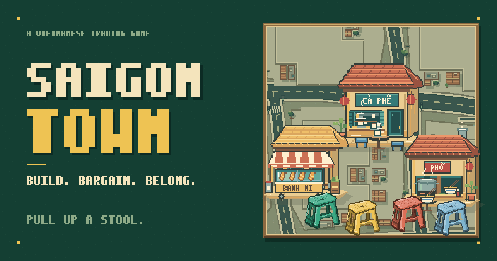
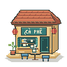
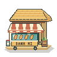
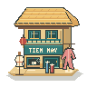
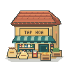

# Saigon Town

[](https://saigontown.phucld.com/)

**Pull up a stool. There’s a deal to make.**

[**Play Saigon Town →**](https://saigontown.phucld.com/) · [Run locally](#run-locally) · [Explore the art](art/)

**1 player · 3 neighbors · 6 years · 72 addresses**

A browser board game about opening shops, bargaining with neighbors, and finding the right corner of a fictional Sài Gòn. Inspired by [Chinatown](https://boardgamegeek.com/boardgame/47/chinatown), built with original Aseprite artwork, and playable in Vietnamese or English.

_Chốt một kèo. Mở một tiệm. Gầy dựng góc phố Sài Gòn._

<p align="center">
  
  
  
  
  
  
</p>

## Six years to make your corner count

You play against Linh, Minh, and An across 72 addresses in six irregular neighborhood blocks. Each year has four steps:

1. **Receive.** Choose your offered plots and collect shop pieces. Your colored stools mark your addresses.
2. **Trade.** Offer cash, plots, and shop pieces. A neighbor’s spare piece might complete your business; your empty corner might be exactly what they want.
3. **Build.** Place shops on your empty plots. Matching shops of your color connect along shared edges within a block. Complete the target printed on each piece to earn more.
4. **Collect.** Every business pays its owner, including unfinished groups. Keep unused pieces for next year.

The most cash after the sixth payday wins. Placed shop pieces break ties. Building is permanent, and roads and diagonal corners do not connect shops. Amounts shown in **đ** are fictional game values.

## A little street life

- Six distinct storefronts: cà phê, bánh mì, phở, flowers, tailoring, and groceries.
- Ninja Lead riders, buses, walking pedestrians, and shop-opening animations.
- A woven chiếu action belt, plastic ownership stools, a tear-off calendar, and a handwritten-style business ledger.
- Visual bargaining, counteroffers, and Vietnamese or English reactions from your neighbors.
- Phase guides, flying banknotes, animated earnings, and locally synthesized lo-fi music and sound effects.

All raster artwork has editable native Aseprite sources under [art/](art/), with Lua drawing and export scripts. Start with the [shop notes](art/shops/README.md), [street-life notes](art/life/README.md), or [tabletop artwork](art/tabletop-v9/README.md).

## Controls

| Action           | Desktop                                                      | Phone or tablet                           |
| ---------------- | ------------------------------------------------------------ | ----------------------------------------- |
| Move around town | Drag the map                                                 | Swipe the map                             |
| Zoom             | Mouse wheel or trackpad scroll over the map                  | Pinch with two fingers                    |
| Build a shop     | Select a piece and click your plot, or drag it onto the plot | Select a piece, then tap your plot        |
| Start a trade    | Click a neighbor or their plot during Trade                  | Tap a neighbor or their plot during Trade |
| Inspect          | Click a player, plot, or the calendar                        | Tap a player, plot, or the calendar       |

With the map focused, **arrow keys** pan, **+ / −** zoom, and **0** resets the view. The shop rack scrolls sideways. Music starts after interaction; music and effects have separate switches in **Settings**.

## Run locally

Use **Node.js 24**, as recorded in [.nvmrc](.nvmrc). With nvm installed:

```sh
git clone https://github.com/phucledien/saigon-town.git
cd saigon-town
nvm use
npm ci
npm run dev
```

Open the local URL printed by Vite, normally [http://127.0.0.1:5173](http://127.0.0.1:5173). Source changes reload automatically. Without nvm, install Node 24 before running the npm commands.

The game is written in strict TypeScript under `src/`. Vite serves the root `index.html` during development and builds a static site for deployment. Exported art and fonts live in `public/assets/`; native Aseprite originals remain in `art/`.

### Check and build

```sh
npm run typecheck
npm run test
npm run build
npm run preview
```

`typecheck` checks the TypeScript source. The test suite uses Node’s built-in test runner through tsx and covers the economy, trades, saved games, camera and gestures, menu/loading flows, audio lifecycle, and preservation of the animated street scene. `build` runs the type check, bundles the game, and verifies the generated entrypoints, local references, sharing metadata, and home-screen assets. `preview` serves that production build locally; it does not publish it.

### Deploy

Configure a static host with:

| Setting           | Value                     |
| ----------------- | ------------------------- |
| Node version      | `24`                      |
| Build command     | `npm ci && npm run build` |
| Publish directory | `dist`                    |

`dist/` is generated and ignored by Git. Commit source, `public/` assets, and the lockfile; let the host build the deployable files. The public game URL and canonical/share metadata use [saigontown.phucld.com](https://saigontown.phucld.com/).

## Around the repository

| Path                                                         | What’s inside                                                          |
| ------------------------------------------------------------ | ---------------------------------------------------------------------- |
| [index.html](index.html)                                     | Browser entry document and sharing/home-screen metadata                |
| [src/main.ts](src/main.ts)                                   | Application and stylesheet entrypoint                                  |
| [src/app.ts](src/app.ts)                                     | Game screen, menus, and interactions                                   |
| [src/engine.ts](src/engine.ts)                               | Game rules, income, trading, and scripted opponents                    |
| [src/types.ts](src/types.ts)                                 | Shared game-state and offer types                                      |
| [src/board-layout.ts](src/board-layout.ts)                   | Shared plot geometry                                                   |
| [src/styles/](src/styles/)                                   | Source stylesheets, assembled in their established order               |
| [public/](public/)                                           | Exported artwork, fonts, downloads, and app manifest                   |
| [art/](art/)                                                 | Layered Aseprite originals, scripts, and asset notes                   |
| [tests/](tests/)                                             | Node tests importing TypeScript through tsx                            |
| [scripts/verify-build.mjs](scripts/verify-build.mjs)         | Local production-build verification                                    |
| [docs/implementation-notes.md](docs/implementation-notes.md) | Economy tables, architecture, save migrations, and research references |

## Current scope

This is a **single-player local game with scripted bots**. There is no online multiplayer or backend. Progress is saved in the current browser; it does not sync between devices, and the local development URL has its own save. The app can be added to a home screen, but it does not provide offline caching.

The main game interface and bargaining dialogue support Vietnamese and English. The research notebook and historical journal entries remain English. The in-game artbook contains design references and downloadable source artwork.

Saigon Town is an independent adaptation with original artwork and a fictional map. Bundled fonts are Be Vietnam Pro, Lora, and Bungee; their license files are included in [public/assets/fonts/](public/assets/fonts/).
